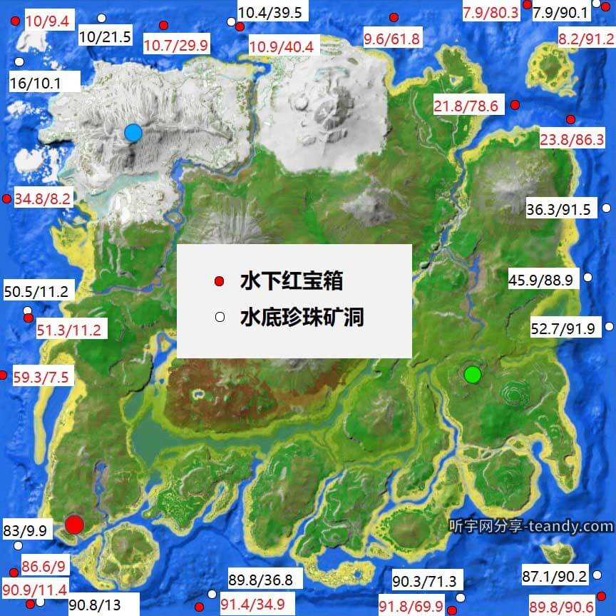
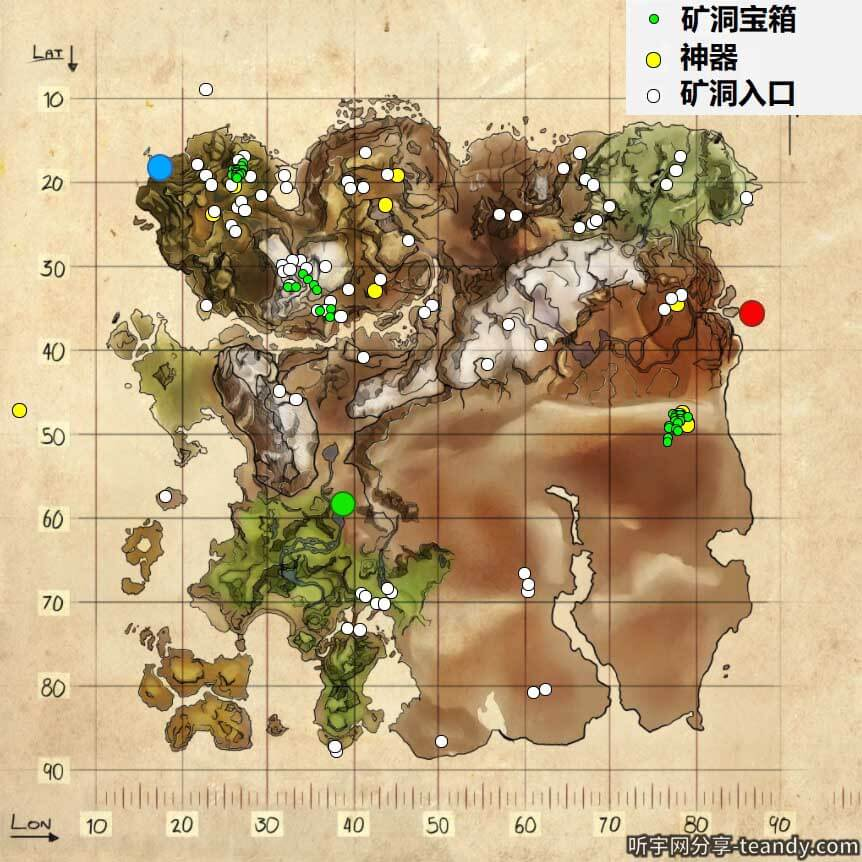
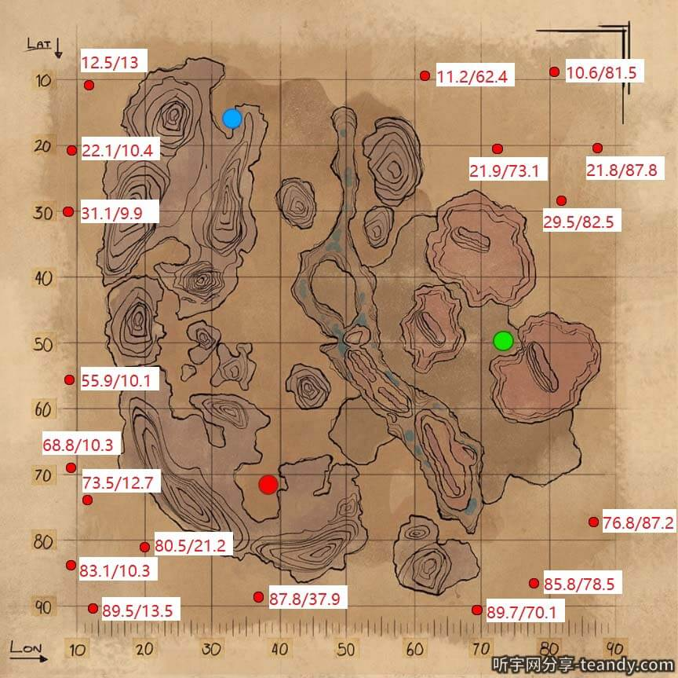
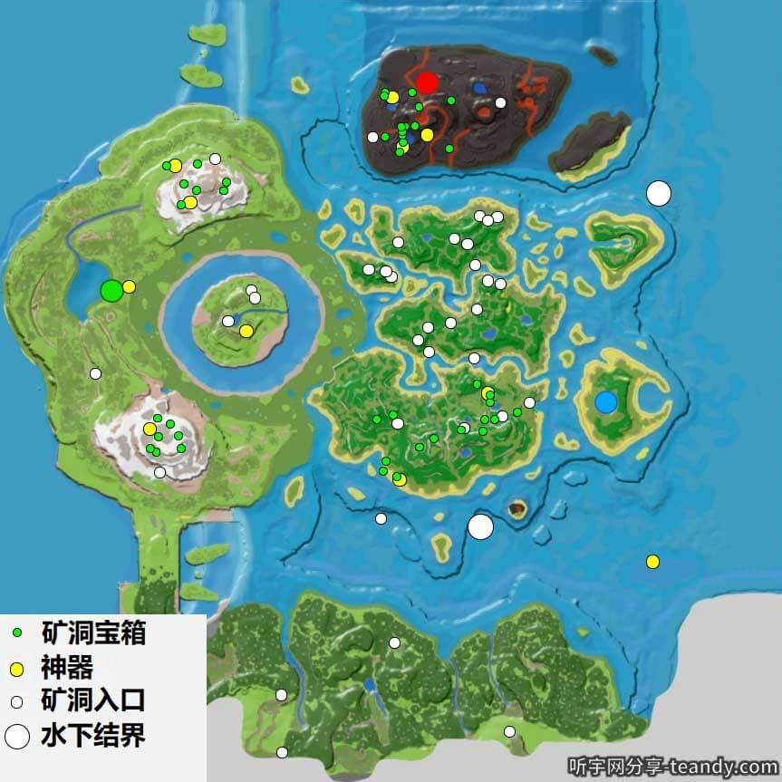
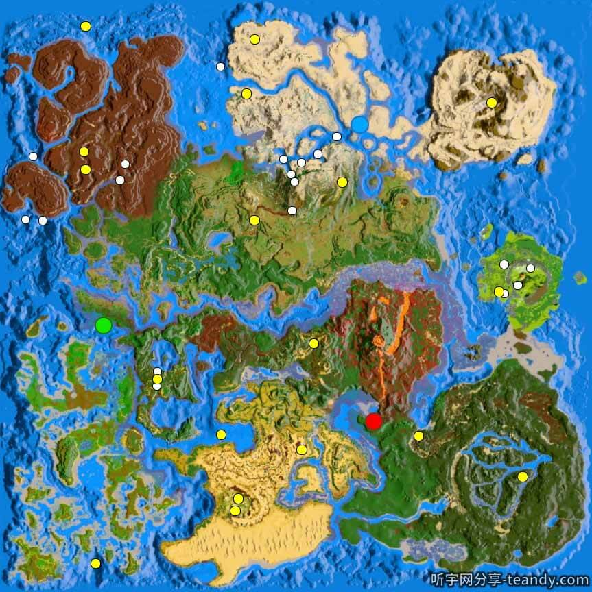
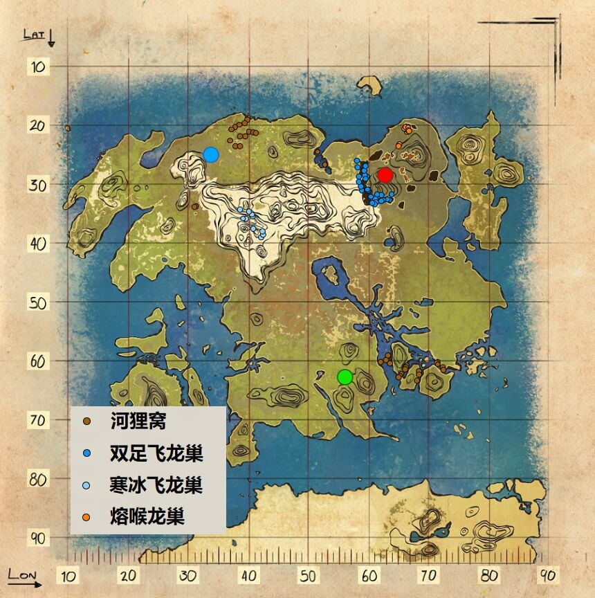
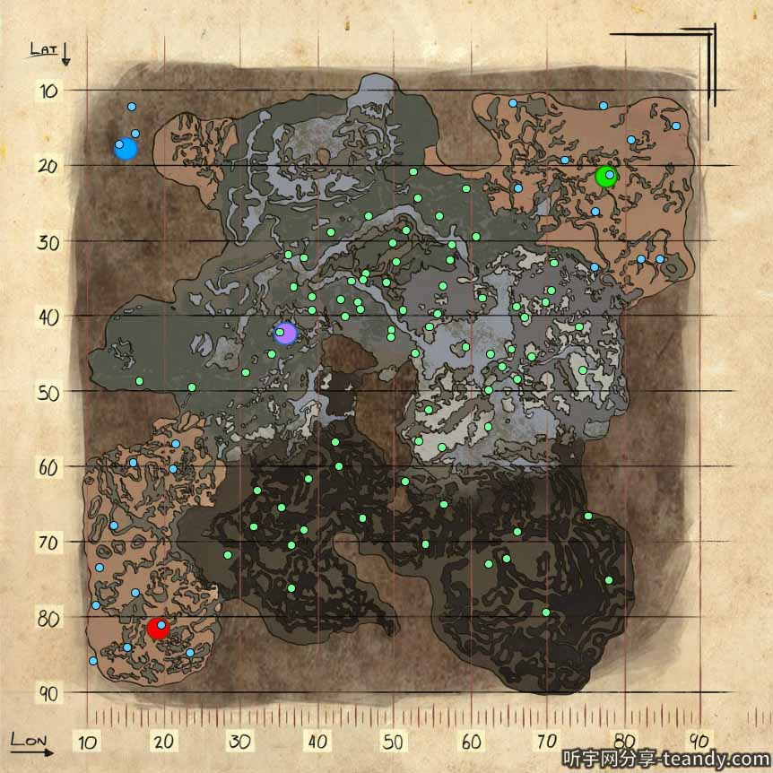
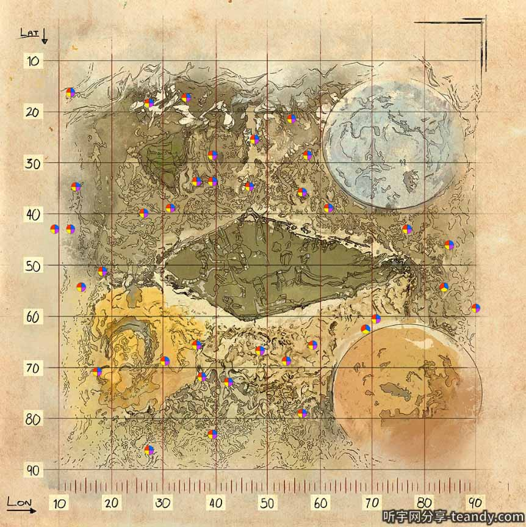
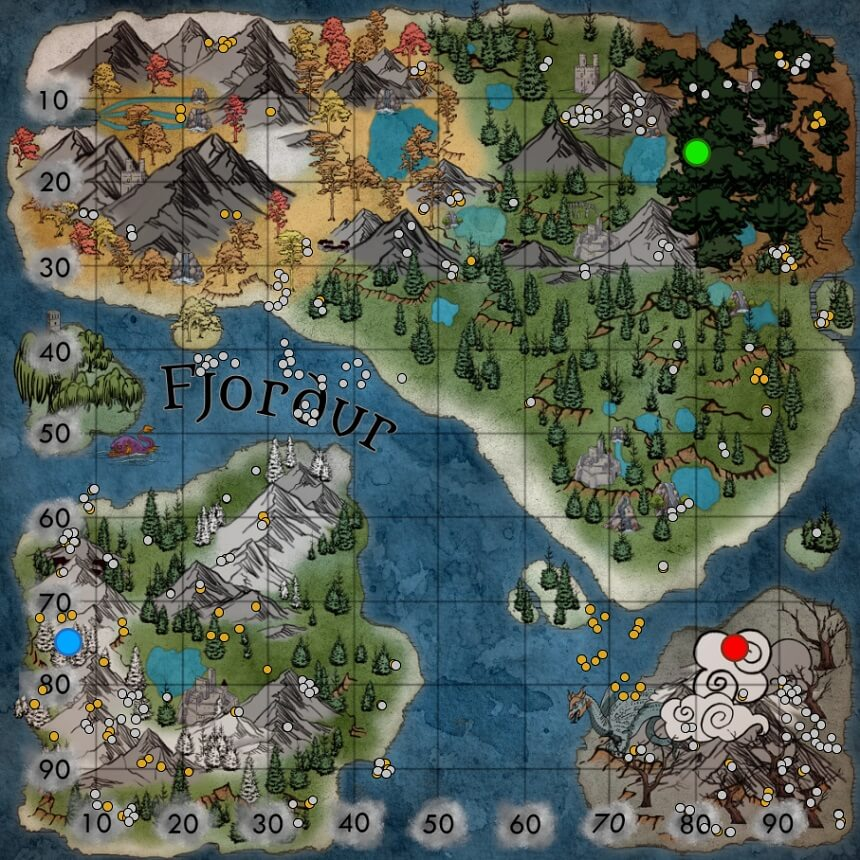
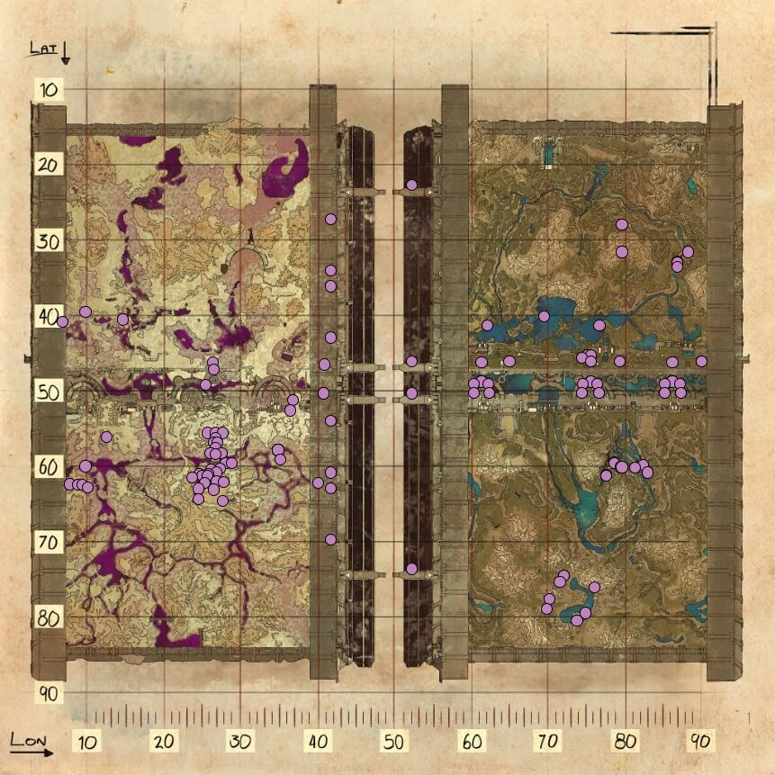

# **孤    岛 (The Island)**

## 地图

## 神器和boss

|  1  |    | **猎手** | **83.5** | **56.0** | 育母蜘蛛 |
| :--: | :----------------------------------------------------------------------: | -------------- | -------------- | -------------- | :------: |
| 入口 |                                   80.2                                   | 53.6           |                |                |          |
|  2  |  | **稳重** | **67.0** | **85.9** |          |
| 入口 |                                   70.5                                   | 86.0           |                |                |          |
|  3  |    | **智慧** | **39.5** | **45.9** |          |
| 入口 |                                   41.5                                   | 47.1           |                |                |          |
|  4  |  | **吞噬** | **16.1** | **84.5** |  大金刚  |
| 入口 |                                   14.8                                   | 85.4           |                |                |          |
|  5  |      | **团结** | **72.9** | **60.9** |          |
| 入口 |                                   68.2                                   | 56.2           |                |                |          |
|  6  |    | **残暴** | **60.8** | **22.0** |          |
| 入口 |                                   53.6                                   | 10.5           |                |                |          |
|  7  |    | **免疫** | **62.1** | **39.5** |  喷火龙  |
| 入口 |                                   62.7                                   | 37.3           |                |                |          |
|  8  |  | **天主** | **19.5** | **18.3** |          |
| 入口 |                                   19.3                                   | 19.0           |                |                |          |
|  9  |  | **狡诈** | **46.4** | **83.3** |          |
| 入口 |                                   45.9                                   | 88.9           |                |                |          |
|  10  |    | **强壮** | **29.9** | **26.5** |          |
| 入口 |                                   29.4                                   | 31.9           |                |                |          |
|      |                               泰克洞穴入口                               | 43.2           | 39.1           | 监察者         |          |

# **仙    境 (Ragnarok)**

## 地图

## 神器和boss

# **焦    土 (Scorched)**

## 地图

# **中心岛 (The Center)**

## 地图

# **水晶岛 (Crystal Isles)**

## 地图

## 神器和boss

# **失落岛 (Lost Island)**

## 地图

## 神器和boss

# **畸    变 (Aberration)**

## 地图

## 神器和boss

# 灭绝（Extinction）:

## 空投和矿脉位置

紫红和5万矿脉：
67.6/30.8、61.2/71.4、84.0/40.8、48.5/83.8、39.3/69.5、36.1/57.9、27.7/58.0、16.6/37.2（南巨谷）、43.5/13.2、19.5/28.8
5万和两万五的矿脉：
72.3/37.8、54/83.7、30.4/53.1、23.0/54.4、34.4/37.6、50.9/19.2、67.3/42.8、27.4/41.5、35.4/47.0、70.8/42.1、65.2/59.1、26.0/48.9
红黄：
66.6/50.2、68.5/56.3、
黄蓝：
78.6/57.3、57.7/90.1
1万矿脉：
43.3/81.2、39.7/32.9

## 神器和BOSS:

# **维京（Fjordur）：**

油井坐标：（想要油最好的方式就是杀龙王鲸和油井获取。）
66.77/31.96
24.33/15.40
24.43/33.52
31.74/67.60
31.27/67.63
81.32/77.40
77.47/78.55
77.99/79.84
78.60/81.77
畸变绿区洞：洞口：40.58/31.65 绿宝石：34.60/31.53
黑珍珠：60.3/52.9
蔬菜：30.9/56.8
水底深渊洞口：52.24/16.88
元素矿石、龙涎香、元素碎片：52.26/10.35
黑珍珠：51.99/06.77、53.79/05.80
企鹅洞：05.41/06.33
白珍珠：48.43/81.74
龙谷水下洞穴白珍珠和石油：53.90/44.48
水晶洞洞穴：47.39/42.69
水晶洞白水晶和石油：44.91/41.74
黑曜石：63.71/17.72
矮人遗迹：83.01/21.22
瓦斯气矿：83.46/14.34
畸变金属矿和蓝宝石：83.10/13.94
金属矿：31.19/52.59
火山旁边的星辰洞：86.13/98.21
可以采集树脂
熔喉洞元素碎片：92.63/92.28

恐龙刷新坐标：

三叶虫：15.16/27.42

### 神器和BOSS：

稳重洞迷宫顺序:
第一：绿黄紫蓝
第二：绿紫黄蓝

# 创世纪2（Genesis 2）:

## 地图

## * 空投宝物以及颜色对应对应太空物资

    绿色空投（金属+水晶）：泰克发电机，防爆服，羽暴龙鞍，低温冰箱，力场护盾。

　红色空投（油+金属）：长管，甲龙鞍，力场护盾，工业熔炉，吉利套，猪鞍。

　白色空投（龙涎香+诱变剂+金属）：恐爪龙鞍，饲料槽，孵蛋器。

　蓝色空投（金属+黑曜石+硫磺）：连喷，泰克枪，巡航，袋狮鞍，泰克炮台，矿枪，榴弹发射器，泰克悬浮艇，岩龙鞍，巨齿鲨鞍，岛龟平台鞍。

　黄色空投（金属+黑曜石+宝石）：南巨鞍，毛皮套，泰克相枪，金属斧头，巨蟹怪鞍，披毛犀鞍，金属剑，金属保险柜，rpg，泰克饲料槽。

　橙色空投（黑珍珠+金属+诱变剂）：吉利套，棘背龙鞍，霸王龙鞍，工业锅，长管，班龙鞍，气囊虫鞍，工业熔炉。

　青色空投（粉尘+金属+黑曜石+石头）：长管，吉利套，传感器，霸王龙鞍，泰克睡眠舱，泰克水壶，班龙鞍。

　紫色空投（元素碎片+元素+金属）：泰克弓，泰克光刃，石头人鞍，泰克睡眠舱，泰克饲料槽，海洋平台，泰克箱子，鲨鱼鞍，工业大锅，剑齿虎鞍。

## * 创2任务：

###  **摩擦摩擦，滑翔滑翔** (鸭嘴飞鼠)

以一种杂技般的速度滑越峡谷，重新控制飞船上的生物成长促进系统！---

 1-5/模拟中   世界增益:幼崽成长速度+50%&留痕间隔-10%---

简单：时限:3分50秒   奖励 基础:0815   世界增益持续：03小时
中等：时限:3分10秒   奖励 基础:1020   世界增益持续：12小时
困难：时限:2分16秒   奖励 基础:1275   世界增益持续：36小时---

奖励概率高出平均值的物品：
龙鞍类居多 / 虚空鲸泰克鞍 / 岩龙泰克鞍

### **电路追逐** (执行者)

飞船的先进探测器仍在通信范围内，迅速穿过迷宫般的管道与之重新建立联系！---

 1-5/创世模拟中   世界增益奖励:小行星箱质量+15%---

简单：时限:5分10秒   奖励 基础:0815   世界增益持续：03小时
中等：时限:4分00秒   奖励 基础:1020   世界增益持续：12小时
困难：时限:3分20秒   奖励 基础:1275   世界增益持续：36小时---

奖励概率高出平均值的物品：
龙鞍类居多 / 沧龙泰克鞍 / 古神翼龙泰克鞍

过关技巧：前面需要不停使用右键加速，在三个平台需要使用右键，在通过旋转的时候不要使用右键，否则跳不进最后的通道。熟悉道路是最后的办法。

###  **激流勇进** (独木舟)

疯狂用桨击打湍急的河水来控制飞船上的无土栽培系统。---

 1-5/创世模拟中   世界增益奖励:农作物生长速度+50%---

简单：时限:10分30秒   奖励 基础:0815   世界增益持续：03小时
中等：时限:07分00秒   奖励 基础:1020   世界增益持续：12小时
困难：时限:05分00秒   奖励 基础:1275   世界增益持续：36小时---

奖励概率高出平均值的物品：
未记载

###  **独木舟比赛** (独木舟/多人合作)

团队比赛进行独木舟探险来暂时摆脱飞船上严酷的生活，赢得新独木舟皮肤！---

 1-3/创世模拟中   世界增益奖励:无---

简单：时限:8分35秒   奖励 基础:0815   现代独木舟皮肤
中等：时限:7分00秒   奖励 基础:1020   维京独木舟皮肤
困难：时限:5分30秒   奖励 基础:1275   泰克独木舟皮肤---

奖励概率高出平均值的物品：
/ 龙鞍类居多 / 巨齿鲨泰克鞍 / 霸王龙泰克鞍

###  **滑流扫掠** (泰克悬停帆)

飞越充满障碍的空中航线，赢得资源开采速度的控制权。可以额外表演特技！---

 1-5/创世模拟中   世界增益奖励:自然资源再生+50%---

简单：时限:6分40秒   奖励 基础:0815   世界增益持续：03小时
中等：时限:5分10秒   奖励 基础:1020   世界增益持续：12小时
困难：时限:4分10秒   奖励 基础:1275   世界增益持续：36小时---

奖励概率高出平均值的物品：
龙鞍类居多

###  **星翼打击** (虚空海豚-竞速)

在一场充满挑战的比赛中，冲破危险和障碍物来控制飞船的导航系统！---

 1-5/创世模拟中   世界增益奖励:小行星资源量+50%---

简单：时限:6分40秒   奖励 基础:0815   世界增益持续：03小时
中等：时限:6分10秒   奖励 基础:1020   世界增益持续：12小时
困难：时限:5分40秒   奖励 基础:1275   世界增益持续：36小时---

奖励概率高出平均值的物品：
龙鞍类居多 / 虚空海豚星翼鞍

### **星际海豚** (虚空海豚-战斗)

袭击罗克韦尔的防御系统重新夺回飞船的复制系统，预计有强烈抵抗！---

 1-4/创世模拟中   世界增益奖励:自然资源耐久度+50%---

简单：时限:20分   奖励 基础:01800   世界增益持续：03小时
中等：时限:20分   奖励 基础:10800   世界增益持续：12小时
困难：时限:20分   奖励 基础:28800   世界增益持续：36小时---

奖励概率高出平均值的物品：
护甲装备、武器 居多 / 泰克留弹发射器 / 泰克头盔 / 泰克剑

### **选择你的冒险** (颜色解谜/Boss:召唤师)

潜入被劫持的生物医学系统阻止罗克韦尔生产诱变剂，小心他留下的超级敌人！---

 1-5/创世模拟中   世界增益奖励:生命恢复速度+50%---

简单：时限:30分   奖励 基础:01900   世界增益持续：03小时
中等：时限:30分   奖励 基础:11400   世界增益持续：12小时
困难：时限:30分   奖励 基础:30400   世界增益持续：36小时---

奖励概率高出平均值的物品：
护甲装备、武器 居多 / 泰克步炝 / 泰克靴 / 泰克狙击炝

### **生命保障** (修毒气室/Boss:跨步者)

在毒气淹没前修复泄露的空气储存罐来净化通风系统，阻止罗克韦尔的阴谋！---

 1-5(1人可带1龙)/创世模拟中   世界增益奖励:体力消耗-25%---

简单：时限:30分   奖励 基础:01900   世界增益持续：03小时
中等：时限:30分   奖励 基础:11400   世界增益持续：12小时
困难：时限:30分   奖励 基础:30400   世界增益持续：36小时---

奖励概率高出平均值的物品：
护甲装备、武器 居多 / 泰克留弹发射器 / 泰克头盔 / 泰克剑

### **红色代码** (若干闯关/Boss:触手南巨)

在基因档案库阻止罗克韦尔破坏生物档案，并防止他的复仇重新入侵系统！---

 1-5(1人可带1龙)/创世模拟中   世界增益奖励:六角币奖励+20%---

简单：时限:30分   奖励 基础:01900   世界增益持续：03小时
中等：时限:30分   奖励 基础:11400   世界增益持续：12小时
困难：时限:30分   奖励 基础:30400   世界增益持续：36小时---

奖励概率高出平均值的物品：
护甲装备、武器 居多 / 泵动霰弹炝 / 泰克手套 / 泰克光刃

**过关技巧**：带死神进入，然后跳到半空中吸引怪，角色通过泰克剑跳进最后防御者打怪场，最后进入使用相强杀死BOSS。

###  **捕获灯泡犬**

追踪并捕获一群发情的灯泡犬，将它们的信息素转化为驯养幼崽可用激素。---

 1-5    世界增益奖励:孵化速度+50%---

简单：时限:60分   奖励 基础:01920   世界增益持续：03小时
中等：时限:60分   奖励 基础:11520   世界增益持续：12小时
困难：时限:60分   奖励 基础:30720   世界增益持续：36小时---

奖励概率高出平均值的物品：
部分护甲装备、武器、鞍 / 泰克肩炮 / 泰克靴 / 泰克狙击炝

###  **捕获鸭嘴飞鼠**

追踪并捕获一群幼年的鸭嘴飞鼠，学习如何快速地让你已训服的生物交配。---

 1-5    世界增益奖励:交配间隔-25%---

简单：时限:60分   奖励 基础:01920   世界增益持续：03小时
中等：时限:60分   奖励 基础:11520   世界增益持续：12小时
困难：时限:60分   奖励 基础:30720   世界增益持续：36小时---

奖励概率高出平均值的物品：
部分护甲装备、武器、鞍 / 泰克剑 / 泰克胸甲 / 泰克盾

###  **捕获巨犀**

追踪并捕获一群贪婪的巨犀，学习如何改善你的新陈代谢。---

 1-5    世界增益奖励:食物和水分消耗-50%---

简单：时限:60分   奖励 基础:01920   世界增益持续：03小时
中等：时限:60分   奖励 基础:11520   世界增益持续：12小时
困难：时限:60分   奖励 基础:30720   世界增益持续：36小时---

奖励概率高出平均值的物品：
部分护甲装备、武器、鞍 / 泰克光刃 / 泰克头盔 / 泰克护腿

###  **狩猎刺面龙**

追踪并杀死一群聪明的刺面龙，学习如何让你学得更快。---

 1-5    世界增益奖励:经验获取增益+50%---

简单：时限:60分   奖励 基础:01920   世界增益持续：03小时
中等：时限:60分   奖励 基础:11520   世界增益持续：12小时
困难：时限:60分   奖励 基础:30720   世界增益持续：36小时---

奖励概率高出平均值的物品：
部分护甲装备、武器、鞍 / 泵动霰弹炝 / 泰克步炝 / 泰克相炝

###  **狩猎猿狐**

追踪并杀死一群猿狐，学习非常有价值的防卫技巧。---

 1-5    世界增益奖励:野生龙造成的伤害-20%---

简单：时限:60分   奖励 基础:01920   世界增益持续：03小时
中等：时限:60分   奖励 基础:11520   世界增益持续：12小时
困难：时限:60分   奖励 基础:30720   世界增益持续：36小时---

奖励概率高出平均值的物品：
部分护甲装备、武器、鞍 / 迷你加特林(急射机炝) / 泰克护手

###  **狩猎影鬃**

追踪并杀死一只高傲的影鬃，学习更加隐蔽致命的攻击技能。---

 1-5    世界增益奖励:已驯服单位的伤害+20%---

简单：时限:60分   奖励 基础:01920   世界增益持续：03小时
中等：时限:60分   奖励 基础:11520   世界增益持续：12小时
困难：时限:60分   奖励 基础:30720   世界增益持续：36小时---

奖励概率高出平均值的物品：
部分护甲装备、武器、鞍 / 泰克弓 / 泰克留弹发射器

###  **擂台大乱斗** (10波敌人)

连续挑战常见生物基因组造出的生物群落，重新控制飞船上的生物安抚系统！---

1-5    世界增益奖励:生物驯服速度+50%---

简单：时限:--   奖励 基础:02280   世界增益持续：03小时
中等：时限:--   奖励 基础:13680   世界增益持续：12小时
困难：时限:--   奖励 基础:36480   世界增益持续：36小时---

奖励概率高出平均值的物品：
未记载

过关技巧：带龙进场是最好的。

# 恐龙

## 战斗龙

## 资源龙

## 辅助龙

要记得搭困龙房呀，花些材料做出来后一劳永逸，抓龙会很简单。有了无齿翼龙就收集材料做石制恐龙门框，做四个，在做2个坚固的大门，骑上翼龙去老鹰刷新点，火山那块多。依次放好门框，然后用翼龙去引老鹰，引进困龙房，关上门，瓮中捉鳖。有了老鹰就可以去抓星尾兽（打石头）、甲龙（打金属）了，靠近按鼠标左键，老鹰就能把它们抓起来了。这个困龙房除了南巨，基本陆地什么龙都能抓。抓龙要靠困龙房哦，单靠自己，大型龙太难抓了，效率还低。老鹰主加血量，防止死。B站teandy听宇的视频很有用，萌新向，可以看看参考，能解决很多弯路哦。工具龙里面剑龙（打果子）、猛犸象（打木头）、镰刀龙（纤维、花朵、木头）、甲龙（金属、燧石）、星尾兽（石头），采集资源还是要靠龙，自己收集实在太慢了

左上角H信息显示，在菜单栏勾选HUD选项之后就不会消失。

方舟：生存进化最实用的五个宠物有哪些？

1. 第一名沼泽魔鬼蛙。拥有一只高等级的魔鬼蛙后，带他去毒气矿洞基本上一趟下来好几千水泥轻轻松松，要知道在水泥极度缺乏的后期，拉上小伙伴，带几只水泥王，去毒气矿洞刷上小几千的水泥，从此告别黑奴生活，岂不美哉？
2. 第二名甲龙。甲龙的特殊能力——尾巴重锤，可以收集大量的铁矿，并且自身对铁矿有负重减轻的效果，可谓妥妥的工具人了
3. 第三名阿根廷巨嘤。阿根廷巨嘤相比翼龙来说虽然速度较慢，但是耐力和负重都是翼龙可望不可即的，一个高等级的阿根廷巨嘤耐力可以到达4000以上，基本飞完整个地图都不用休息啊
4. 第四名镰刀龙。驯服后的镰刀龙有不俗霸王龙的战斗力，更牛的是，他还是采集木材纤维茅草和稀有花朵的好能手。如果运气好能抓到一只，会帮你节省不少的“黑奴”工作
5. 第五名迅猛龙。迅猛龙最主要的用途是前期较好的代步工具，比起似鸡龙（方舟跑车）来说更加容易补抓，只需要用流星锤困住木棒打晕即可。前期拥有一支甚至一群迅猛龙能让你更安全更快的找到自己合适的安家位置，是前期非常不错的搭档

# 方舟BUG集合

1. 【双号刷资源】
2. 【创2大乱斗带龙】
3. 

# 资源点

方舟1.5：
海底红宝箱：
4.4-0.3
4.0-27.1
5.0-38
2.5-63.5
0.9-85.3
3.4-98
17.3-84.9
43.2-99.1
60.8-99.0
96.4-98
99.2-70.6
98.8-31.9
97.9-4.9
93.1-12.5
60.4-0.2
32.4-0.9
