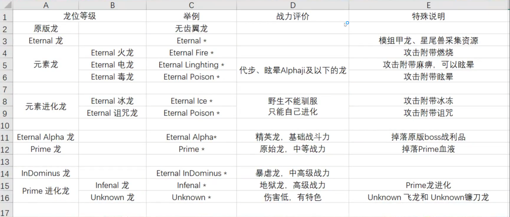

# 方舟生 存进化永恒模组攻略

永恒MOD全称Ark Eternal

## 需要添加的模组ID

1. 永痕模组：893735676（永恒自带捡蛋器，墓碑，小A镜，解飞）。
2. A镜（用于看血量，眩晕，驯服食物）
3. 传送器（跑腿神器）
4. 1W叠加
5. 唯一模组（主要用飞行背包和护肝万能地）。

## 模组介绍

## BOSS召唤

1、Eternal
Boss Summoner

  1.1、Matrix（原版Boss）

 1.1.1、 Aberration Boss（畸变Boss）

    罗克韦尔

    1.1.2、Vanilla
Boss（主大陆Boss）

   BroodMother（育母蜘蛛）Gorilla（大猩猩）Titans（灭绝小泰坦）喷火龙、狮身蝎尾兽

    1.2、Summons（Mod
Boss）

    1.2.1、Ancients

    7种未来龙，可以驯服。战斗力一般，比地狱龙优秀，比黑星差，召唤材料需要低温仓，进化黑星性价比更高。

    1.2.2、Armored
Darkstar

    击杀后获取神秘元素（Mysterious Element）进化暗黑之星的过程用，但是其他Boss也会掉，可以不打。

    1.2.3、Endbosses

    URSA
MAJOR HARD MODE（武装大猩猩困难模式），消耗10个低温仓，掉落7个红牌子，概率掉落1个永恒神祠（ETERNAL GOD SHRINE）每十分钟（辅助可修改）消耗6个汽油产出若干物资(含MOD物资)。

    1.2.4、Endboss

10个低温仓制作，掉落1个红牌子和对应的旗帜，性价比不高，建议只打一次

Phantasmal
Manticore（幻影狮蝎）

Phantasmal
BroodMother（幻影育母蜘蛛）

Phantasmal（幻影大猩猩）

    1.2.5、Harbinger

有5种小Boss，击败后会掉落一个召唤mod蜣螂的球，使用后获取一个驯服的螳螂，在螳螂的背包内放置Eternal Kibble并开启巡逻模式会产出基础资源，速度很慢，不如去采集。

    1.2.6、Mystical

神秘系列龙掉落做进化暗黑之星的材料低温仓的原材料。召唤出来的BOSS能力很强，地狱南巨需要很好的鞍具和防御时装（Immortal Armor Stone），并且配合回血药战斗，回血药放在个人的快捷栏，骑龙时使用会作用于龙身上。BOSS拥有20%的伤害减免，BOSS难度排序：猩猩（Bigfoot）= 猛犸（Mammoth）< 犀牛（Rhino）= 飞龙（Wyvern）< 南巨（Giga）(每个<对你造成伤害翻倍)。由于BOSS过于强力，可以考虑繁殖一大批龙利用群体BUFF+配偶加成+献祭流击杀。

    1.2.7、Other

1、Tributes：使用后召唤一个石头人，可以驯服，可以进化，能力类似于地狱龙。

2、Bionic
Giga（机械南巨）击败后掉落11个神器，有10% 机会召唤出一只可驯服放机械南巨，其背包内可以制作能量元素、元素碎片、元素泰克枪、上古神器。制作神器需要4种基础水晶各200个、200聚合物、5个Futurustic orb，如果材料不很足的情况的下可以选择继续召唤Bionic Giga击杀，在场的人均会获得11个神器，直接到背包。注意：由于人物不能携带多个同名神器，一次召唤多个Bionic Giga是不会获得多个神器的。

3、Undead
Wyvern（不死飞龙）击杀后掉落4个红色牌子
原始精粹（PRIMORDIAL ESSENCE），概率掉银萝卜。

4、Evo
Compy Summon Reagent 使用后获得一个1级咦驯服的美颌龙，可以进化成为黑暗之星。

5、Bionic
Magmasaur（机械熔喉咙）1阶BOSS，会掉落1个红色牌子

6、Terra
Nova summon reagent

15个紫色牌子制作，杀死之后获得一个球，使用后获得900级Terra Nova，红色嘟嘟南巨。

    1.2.8、Sub_Boss

Ghost Saber：概率掉永恒神祠（ETERNAL GOD SHRINE）和金萝卜（GOLDEN CARROT）

Treasure turkey:概率掉制作低温仓的5种水晶

Death Worm：掉落原始肉（Prime Meat）和
时空虫子（Graboid Parasite）

2、Eternal
Boss Summoner Hard Mode

    2.1、DarkStar

召唤困模式的暗星，需要300龙血15个红色牌子1个神器。击杀后掉落8枚蓝色牌子。

    2.2、Endboss
Hard Mode

有4种BOSS，狮蝎、蜘蛛、大猩猩、武装、大猩猩，制作需要消耗10个低温仓，拥有75%的伤害减免，掉落6-8个蓝色牌子。死后概率召唤其他BOSS，大猩猩具有复制你的龙位野生龙（不可驯养）的能力，但是没鞍和留痕。概率掉落1个永恒神祠BOSS版（ETERNAL GOD SHRINE（BOSS Items））每十分钟（辅助可修改）消耗6个汽油产出若干物资(含BOSS材料和神器)。

    2.3、Mystical

前五个跟普通模式一样，但掉落是普通模式的三倍（3个红牌子，3个BOSS水晶），同时还给2个蓝色牌子。

第六个（颜色不同的）为无齿翼龙，掉落3个翼龙BOSS水晶，可以1:1转换为其他BOSS水晶，同时还会掉落特殊的迷你方舟样的物资生产器，具体产出看名字内的标注，放入一个同名字的材料作为燃料，没十分钟生产一次，一次产出1个，各种原版BOSS头（畸变大小泰坦、灭绝罗克韦尔、创世莫德尔，简单中等困难）。

    2.4、Other

Bionic
Giga(Hard Mode)      掉落两个蓝牌子，10%概率召唤可驯养的机械南巨。

Evo
Pego Summon Readgent    双坚颌龙，起源黑星进化路线的起点

Bionic
Magmasaur(Herd Mode) 掉落一个蓝牌子，会召唤各种Mystical Boss。

EvoFly
Archa Summon Readent 始祖鸟，狮蝎进化路线的起点

    2.5、Sub_Boss

God
Titan：击杀后概率召唤可驯服放版本，能力类似于地狱龙。

3、Eternal
Boss Summoner GOD Mode

3.1、Bionic
Magmasaur(Herd Mode) 机械熔喉龙上帝模式

3.2、Resurrecred
Golen God Mode 骨架石头人，会不停召唤一堆骨架龙

3.3、Dark
Hierophant 黑暗祭祀，大死神，会召唤死神小弟，小弟有击飞效果，如果BOSS附近没有人，Boss会消失，所以打的时候要在某个受限的空间打，大约一个泰克防护罩最大面积的空间就行了，注意不要把BOSS卡到边缘，会卡没。

## 参考：

1. [【图片】方舟永恒mod攻略【方舟生存进化吧】_百度贴吧](https://tieba.baidu.com/p/7261876584)
2. [【图片】方舟永恒mod【Ark Eternal】攻略【方舟生存进化吧】_百度贴吧](https://tieba.baidu.com/p/6549441461)
3. [方舟生存计划永恒MOD新手攻略【方舟生存进化吧】_百度贴吧](https://tieba.baidu.com/p/6434562376?pn=1)
